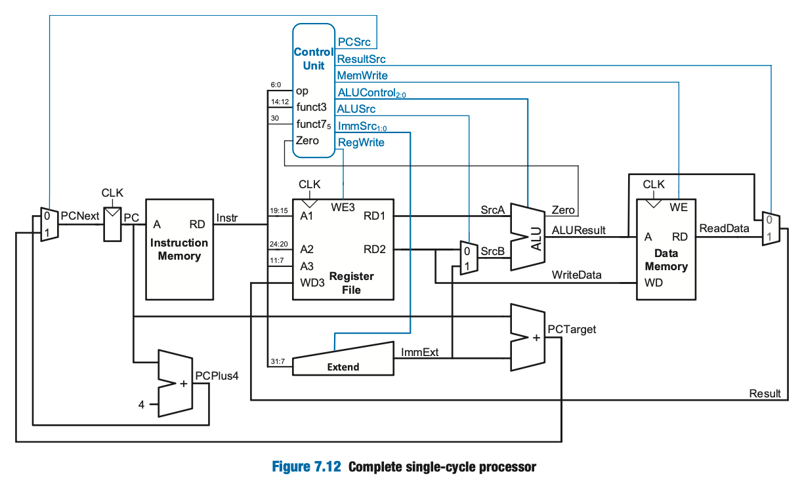

__Compile (ignore warnings):__
verilator -Wall -Wno-fatal --binary --timing --trace \
  *.sv datapath/*.sv ctrl/*.sv utils/*.sv \
  --top-module testbench

__Run Testbench:__
./obj_dir/Vtestbench

---

__Supported Reduced Instruction Subset:__

This pipelined processor currently implements a reduced RV32I subset:

| Category | Instructions | Decoder path |
| --- | --- | --- |
| R-type ALU | `add`, `sub`, `slt`, `or`, `and` | `0110011` opcode, then `funct3`/`funct7` in `aludec.sv` |
| I-type ALU | `addi`, `slti`, `ori`, `andi` | `0010011` opcode, then `funct3` in `aludec.sv` |
| Load | `lw` | `0000011` opcode |
| Store | `sw` | `0100011` opcode |
| Branch | `beq` | `1100011` opcode, ALU subtraction, and `ZeroE` |
| Jump | `jal` | `1101111` opcode |

Note: the main decoder mostly checks opcode only. For loads, stores, and branches,
this design treats the supported opcode class as `lw`, `sw`, or `beq`.

